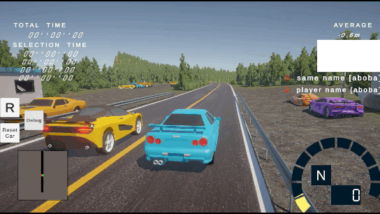
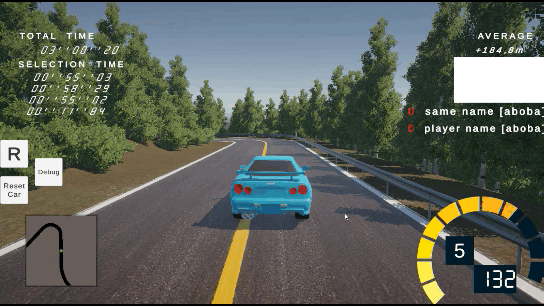

 
    <h1>JCD</h1>
     

# Description

### [Ru]
  
В этом проекте я хотел попробовать себя в разработке гонок.
Проект еще в работе 

У меня получилось ознакомиться и/или поработать с :
- Колесным коллайдером;
- Разными контроллерами машин;
- Созданием трасс;
- Реализвцией следов от шин;
- Партиклами дыма;
- Светом фар;
- Кобольд юаем;
- Юнити аудио;

### [En]

In this project, I wanted to try my hand at developing racing games.

I was able to familiarize myself with and/or work with:
- Wheel collider;
- Various car controllers;
- Track creation;
- Implementing tire tracks;
- Smoke particles;
- Headlights;
- Kobold UI;
- Unity audio;

# Mechanics in the project:

### [Ru]

### 1. В Игре присутствует:

- Возможность выбрать машину в гараже;
  (Пока что настроена N34)
- Возможность выбрать карту;
  (Тренировка настроена, Акина донастраивается)
- Возможность выбрать музыку при выборе карты;
  (Пока что только 2 саунда)
- Возможность выбрать игровой режим;
  (Пока что только тренировка)
 

- Так же есть неплохой визуал с анимациями;
- Возможность ставить рекорды (но только локально);
- Возможность менять громкость (как в меню так и в игре);
- При завершени гонки показывается время каждого сигмента и общее время;

### [En]

- Ability to select a car in the garage;
(N34 is currently configured)
- Ability to select a map;
(The training is set up, Akina is being fine-tuned)
- Ability to select music when selecting a map;
(Currently only 2 sounds)
- Ability to select a game mode;
(Currently only a training session)
 

- There's also a nice visual with animation;
- Ability to set records (but only locally);
- Ability to change the volume (both in the menu and in-game);
- At the end of a race, the time of each segment and the total time are displayed;

# Video

### Options in game:

 
    
 

 
    
 

